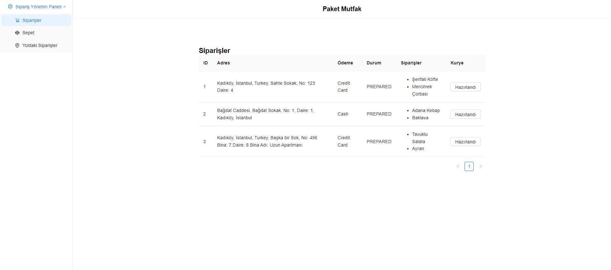
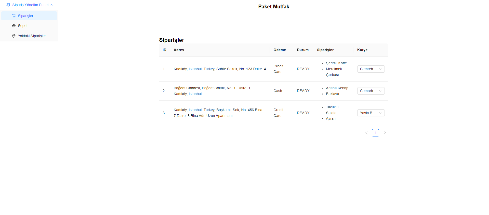
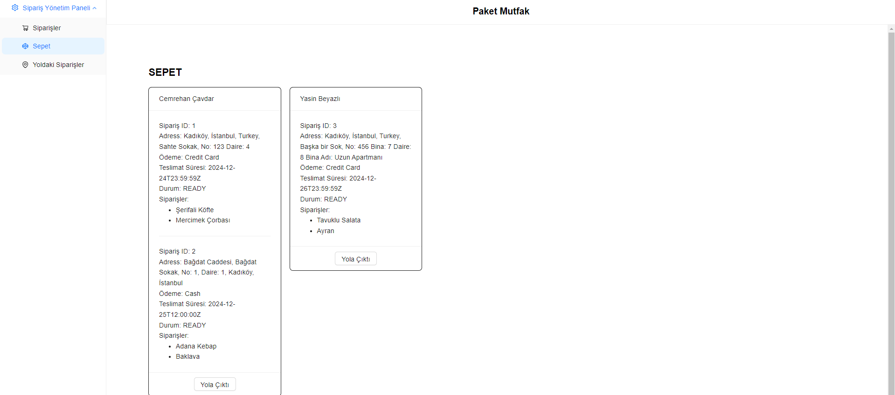
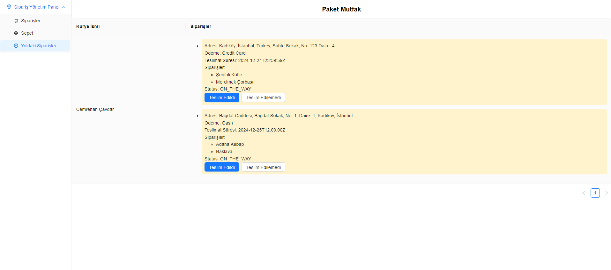
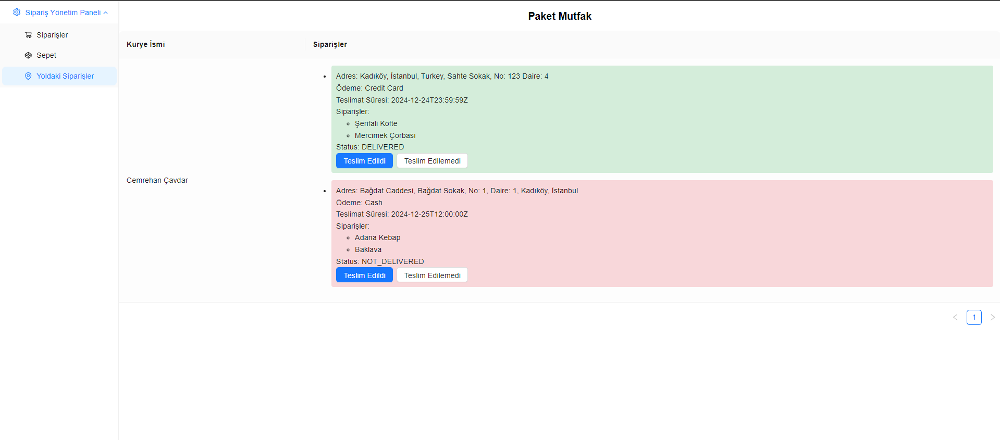

# Proje başlatma

1- node package indirin.

### `npm install`

2- Api ye istek atmak önce db.json içerisine girin basket listesini boşaltın "baskets": [], orders objeleri içerisinde "courier_id" propertylerinin olmadığına ve "status": "PREPARING" olduğuna emin olduktan sonra json-serve yi ayağa kaldırın .

### `npm run serve-json`

3- Projeyi çalıştırın.

### `npm start`

